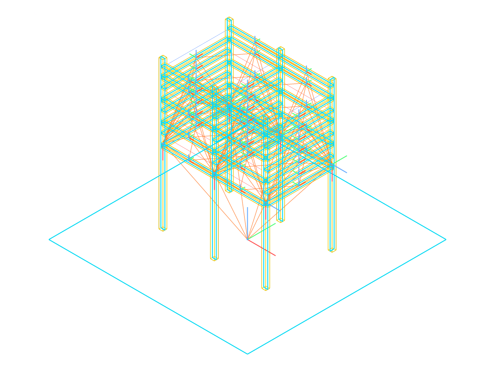

# RhinoMCP Mod

RhinoMCP Mod is a derivative work based on the original [RhinoMCP](https://github.com/jingcheng-chen/rhinomcp) project by Jingcheng Chen.

- Original project: `jingcheng-chen/rhinomcp`
- This repository adapts and extends the original implementation.


## Let your AI agents see the geometry




This repository extends Rhino MCP with deeper geometric and topological context for AI-assisted design in Rhino3D.

### 1. Improved Geometry Understanding

Compared to baseline object metadata, this mod exposes richer geometric semantics (via tools like `get_object_info` / `get_objects_info`):

- Local and world representations for supported geometry
- `pose.world_from_local` frames for lines, curves/polylines, breps, and extrusions
- Planarity-aware curve/polyline summaries
- OBB-oriented summaries for complex solids (brep/extrusion)
- Geometry details suitable for downstream reasoning

### 2. Added Topological Context

This mod adds a connectivity graph pipeline:

- MCP tool: `get_connectivity_graph`
- Rhino command: `mcpmodgraph`

The graph returns compact node/edge topology (including representative contact points), so AI can reason about adjacency/connectivity instead of isolated objects.

### 3. Pose-Aware and Batch Transform Workflows

This mod adds stronger pose operations for reliable editing pipelines:

- Single + batch tools for modify/rotate/copy operations
- Pose rebasing without moving geometry: `rebase_object_pose`, `rebase_objects_pose`
- Pose reset controls: `reset_object_pose`, `reset_objects_pose`
- Rotation helpers such as `invert_rotation_matrix`


## Basic Installation

### 1. Install RhinoMCP Mod Plugin (Mac and Windows)

1. Open Rhino.
2. Go to `Tools > Package Manager`.
3. Search for `rhinomcp-mod`.
4. Click `Install`.
5. In Rhino command line, run `mcpmodstart`.

### 2. Install uv

#### macOS

```bash
brew install uv
```

#### Windows (PowerShell)

```powershell
powershell -c "irm https://astral.sh/uv/install.ps1 | iex"
```

### 3. Configure Claude Desktop MCP

Use this config in your Claude Desktop MCP config file:

```json
{
  "mcpServers": {
    "rhino": {
      "command": "uvx",
      "args": ["rhinomcp-mod"]
    }
  }
}
```

#### macOS Claude config path

`~/Library/Application Support/Claude/claude_desktop_config.json`

#### Windows Claude config path

`%APPDATA%\\Claude\\claude_desktop_config.json`

After saving config, restart Claude Desktop.

## Development Setup (Local Source)

For active development, use a separate MCP entry (for example `rhino-dev`) so it does not conflict with the published `uvx rhinomcp-mod` setup.

### 1. Run the MCP server from local source

Use `uv run` from your local `rhino_mcp_server` folder:

```json
{
  "mcpServers": {
    "rhino-dev": {
      "command": "uv",
      "args": [
        "--directory",
        "/absolute/path/to/rhinomcp_mod/rhino_mcp_server",
        "run",
        "rhinomcp-mod"
      ]
    }
  }
}
```

Replace `/absolute/path/to/rhinomcp_mod` with your local checkout path.

### 2. Build and load local plugin

1. Build `rhino_mcp_plugin/rhinomcp.sln` in `Debug` or `Release`.
2. Load the generated `.rhp` from `rhino_mcp_plugin/bin/<Configuration>/net7.0/` in Rhino.
3. Run `mcpmodstart`.

### 3. Enable only one server entry

Keep only one server enabled at a time (`rhino` or `rhino-dev`) to avoid duplicate connections.

### 4. Start and Verify

1. Start Rhino and run `mcpmodstart`.
2. Optional: run `mcpmodgraph` to toggle connectivity graph display.
3. Open Claude Desktop.
4. Confirm Rhino tools appear in Claude (hammer/tools icon).


## Credits

- Original project and concept: [Jingcheng Chen](https://github.com/jingcheng-chen)
- Upstream repository: [jingcheng-chen/rhinomcp](https://github.com/jingcheng-chen/rhinomcp)
