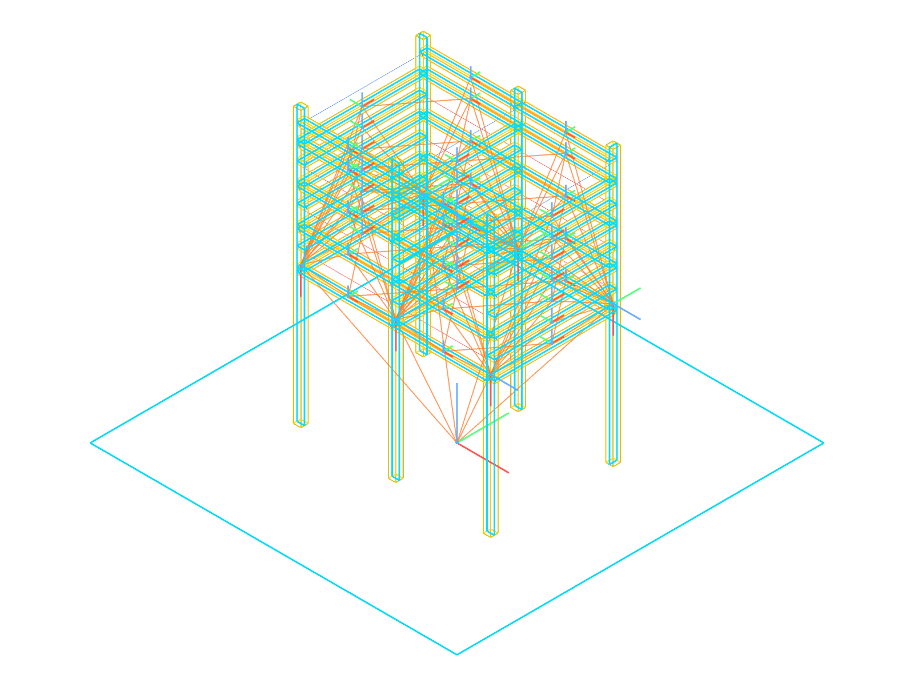

# RhinoMCP Mod

RhinoMCP Mod is a derivative work based on the original [RhinoMCP](https://github.com/jingcheng-chen/rhinomcp).

## Let your AI agents see the geometry




This repository extends Rhino MCP with deeper geometric and topological context for AI-assisted design in Rhino3D.

### 1. Improved Geometry Understanding

Compared to baseline object metadata, this mod exposes richer geometric semantics (via tools like `get_object_info` / `get_objects_info`):

- Compact scene inventory via `get_document_info(detail="inventory")`
- Local-first detailed geometry with optional world duplicates
- `pose.world_from_local` frames for lines, curves/polylines, breps, and extrusions
- Planarity-aware curve/polyline summaries
- OBB-oriented summaries for complex solids (brep/extrusion)
- Geometry details suitable for downstream reasoning

Rhino visualization command for this geometry cache:

- Rhino command: `mcpmodobb` (toggle OBB + projection profile display)
- Rhino command: `mcpmodclearcache` (clear cached pose/OBB user strings)

### 2. Added Topological Context

This mod adds a connectivity graph pipeline:

- MCP tool: `get_connectivity_graph`
- Rhino command: `mcpmodgraph`
- Rhino command: `mcpmodgraphexport` (write the computed graph to a JSON file)

The graph returns compact node/edge topology (including representative contact points), so AI can reason about adjacency/connectivity instead of isolated objects.

The computed graph is cached in document user text under `rhinomcp-mod:connectivity-graph`, so it survives save/reopen. A fingerprint of the graph-relevant document state (candidate object ids + quantized bounding boxes + tolerance) is stored with it; the stored graph is reused only while that fingerprint matches, otherwise it is recomputed and rewritten. `get_connectivity_graph` reports which path was taken in `source` (`document_text_cache` or `computed`). `mcpmodclearcache` (without `SelectedOnly`) removes the stored graph.

### Scene Inspection Contract

Use `get_document_info` as the first scene-index call. Its default is intentionally compact:

```text
get_document_info(detail="inventory", limit=100, offset=0, include_bbox=true)
```

For focused edits, scope the inventory to a world axis-aligned bounding box:

```text
get_document_info(detail="inventory", bbox=[[0,0,0],[100,100,30]], bbox_mode="intersects")
```

Supported `detail` values:

- `inventory`: id, name, type, layer, and optional world axis-aligned `bbox`.
- `summary`: inventory fields plus compact descriptors such as point counts, planarity, face counts, and material/color.
- `full`: legacy per-object document payload. Use sparingly; prefer `get_objects_info` for detailed geometry of selected targets.

Pagination and truncation fields:

- `object_count`: total object count in the document.
- `objects_returned`: number of objects in this response.
- `objects_truncated`: true when more objects are available.
- `objects_offset` / `objects_limit`: page position and page size.
- `spatial_filter`: present when `bbox` is supplied; includes normalized world AABB,
  `bbox_mode`, and matched object count.

For detailed geometry, first identify target ids/names from `inventory` or `summary`, then call `get_objects_info(objects=[...], geometry_detail="obb_pose")`.

- `geometry_detail="bbox"`: world AABB only, cheapest detailed lookup.
- `geometry_detail="obb_pose"`: default detailed mode. Curves/lines return local coordinates + pose; solids return OBB extents + pose.
- `include_world=true`: re-add world-space duplicates such as `world_points`, `world_start`/`world_end`, and `obb.world_corners`.

Use `max_geometry_points` with `detail="full"` only for legacy document payloads.

Viewport captures preserve the active Rhino view by default. `capture_view(..., preserve_view=true)`
temporarily applies the requested camera, projection, lens, fit, and display mode, captures the
bitmap, then restores the original viewport state. Set `preserve_view=false` only when the capture
is intentionally meant to become the new active view. Perspective/isometric presets use 50 mm
unless `lens_mm` is supplied explicitly; they never inherit a lens value from a parallel viewport.

### 3. Pose-Aware and Batch Transform Workflows

This mod adds stronger pose operations for reliable editing pipelines:

- Single + batch tools for modify/rotate/copy operations
- Pose rebasing without moving geometry: `rebase_object_pose`, `rebase_objects_pose`
- Pose reset controls: `reset_object_pose`, `reset_objects_pose`
- Rotation helpers such as `invert_rotation_matrix`
- Geometry-detected poses are recomputed after transforms so OBBs remain minimal; explicitly
  rebased poses are tagged separately and remain attached to the object through later transforms.


## Basic Installation

### 1. Install RhinoMCP Mod Plugin (Mac and Windows)

1. Open Rhino.
2. Go to `Tools > Package Manager`.
3. Search for `rhinomcp-mod`.
4. Click `Install`.
5. In Rhino command line, run `mcpmodstart`.

### 2. Install uv

#### macOS

```bash
brew install uv
```

#### Windows (PowerShell)

```powershell
powershell -c "irm https://astral.sh/uv/install.ps1 | iex"
```

### 3. Configure Claude Desktop MCP

Use this config in your Claude Desktop MCP config file:

```json
{
  "mcpServers": {
    "rhino": {
      "command": "uvx",
      "args": ["rhinomcp-mod"]
    }
  }
}
```

#### macOS Claude config path

`~/Library/Application Support/Claude/claude_desktop_config.json`

#### Windows Claude config path

`%APPDATA%\\Claude\\claude_desktop_config.json`

After saving config, restart Claude Desktop.

## Development Setup (Local Source)

For active development, use a separate MCP entry (for example `rhino-dev`) so it does not conflict with the published `uvx rhinomcp-mod` setup.

### 1. Run the MCP server from local source

Use `uv run` from your local `rhino_mcp_server` folder:

```json
{
  "mcpServers": {
    "rhino-dev": {
      "command": "uv",
      "args": [
        "--directory",
        "/absolute/path/to/rhinomcp_mod/rhino_mcp_server",
        "run",
        "rhinomcp-mod"
      ]
    }
  }
}
```

Replace `/absolute/path/to/rhinomcp_mod` with your local checkout path.

### 2. Build and load local plugin

1. Build `rhino_mcp_plugin/rhinomcp.sln` in `Debug` or `Release`.
2. Load the generated `.rhp` from `rhino_mcp_plugin/bin/<Configuration>/net7.0/` in Rhino.
3. Run `mcpmodstart`.

### 3. Enable only one server entry

Keep only one server enabled at a time (`rhino` or `rhino-dev`) to avoid duplicate connections.

### 4. Start and Verify

1. Start Rhino and run `mcpmodstart`.
2. Optional: run `mcpmodobb` to toggle OBB + projection profile visualization.
3. Optional: run `mcpmodgraph` to toggle connectivity graph display.
4. Optional: run `mcpmodgraphexport` to save the computed connectivity graph as JSON.
5. Optional: run `mcpmodclearcache` to clear cached pose/OBB user strings.
6. Open Claude Desktop.
7. Confirm Rhino tools appear in Claude (hammer/tools icon).


## Experimental Assembly Stability

An assembly is evaluated as separate rigid bodies resting on one another, joined where the
geometry says they touch, under gravity. The question it answers is whether the thing stands
up: whether it is a mechanism, whether an element rotates off its support, whether a stack
topples. It is a first check on a configuration, not a structural analysis.

Try it on the models in [`RhinoAndGHFiles/`](RhinoAndGHFiles/README.md), whose answers are
known independently of the solver.

Requires Rhino 8 with Grasshopper/Kangaroo. The plugin loads Rhino's installed
`KangarooSolver.dll` at runtime; developers can override its location with
`KangarooSolverPath` and `RHINOMCP_KANGAROO_PATH`. The Yak package ships no private copy.

### Joints have a type

Geometry cannot tell a screwed panel from a dry-stacked one - they look identical to an
intersection test - so the connection is stated rather than guessed. Three types, and the
type decides how the measured bearing is used:

| type | carries | what it is |
| --- | --- | --- |
| `contact` | compression and moment until it opens; friction across it | dry masonry, a beam on a corbel, a panel on a pad |
| `pin` | force in three directions, no moment | truss to truss, a single bolt |
| `welded` | force and moment, both ways, always | a moment connection: beam to column, a rigid plate |

The moment comes from the *spread* of the bearing, not from the type: a joint reduced to a
point has no lever arm and resists no rotation, so `pin` collapses the bearing to its centre
and the other two keep its extent.

A joint nobody names is a `contact`. It is the only one of the three that describes two
things merely found touching - `welded` is the strongest assumption available applied where
the least is known, and `pin` hangs in tension and discards the bearing, which turns a stack
into a mechanism hinged at points that exist nowhere in the drawing.

State the rules by element class, not joint by joint:

```python
assign_joint_type(joint_type="pin", layer="Truss", with_layer="Truss")
assign_joint_type(joint_type="contact", layer="Truss", with_layer="Pads")
assign_joint_type(joint_type="welded", layer="Beams", with_layer="Columns", capacity_kn=40)
```

A pair rule beats an element rule beats the default, and where two elements disagree the
weaker governs - a hinge assumed where a moment connection exists reports the structure
softer than it is, which fails safe. The result reports each joint's resolved type and the
rule that decided it, so a verdict that changed because a rule matched more than intended can
be diagnosed without re-deriving the rules by hand.

`capacity_kn` is optional and limits **tension**, per bearing point, which is what gives a
joint a moment capacity as well as an axial one. It yields rather than breaking. Read
`peak_point_tension_n` and never the net: a cantilever's connection can sit in net
compression at -7.1 kN while one of its bearing points is pulled at 24.5.

### Bearings are measured, not assumed

A joint is built over the polygon two flat faces actually share, on the mean plane between
them. One rule covers all three states two solids can be drawn in - nearly touching,
touching, and overlapping:

| the two faces | what the solver gets |
| --- | --- |
| near parallel | the shared polygon |
| crossing, no overlap | the line they cross along - a hinge about itself |
| crossing and overlapping | the surface inside the shared volume, **off by default** |

The last is gated behind `bearing_source="buried"` because its area grows with how far the
drawing goes through itself, which would hand a joint capacity in proportion to a modelling
artefact. Left off, such a contact falls back to a point, which carries no moment. Curved
faces have no flat region to intersect and are sampled instead.

Run `mcpmodgraph` to see all of this drawn on the model: what the evaluator found, where it
found it, and what each joint resolved to. A joint the graph never found cannot be given a
type, and a bearing measured on the wrong plane restrains the wrong rotation - both are
visible there and neither is visible in a number.

### The workflow

**1. Build the connectivity graph.** `mcpmodgraph` turns it on; object changes invalidate and
rebuild it automatically, and it is stored in the document under
`rhinomcp-mod:connectivity-graph`.

**2. Give every element a mass.** `mcpmodassignmass` prompts per object,
`mcpmodassignmissingmass` only for those without one, and `mcpmodassignlayerdensity` +
`mcpmodmassfromlayerdensity` derive mass from each object's own volume. Over MCP, `assign_mass`
does it without prompting - scoped by `ids`, `names`, `layer` or `selected` - taking either a
`density` in kg/m³ or one `mass` in kg. Objects with no computable volume are reported under
`skipped` rather than guessed at.

Metric documents take `kg` and `kg/m³`, imperial take pound-mass (`lbm`, never pound-force)
and `lbm/ft³`. Mass is converted and stored as tagged canonical `kg`. Documents with `None`,
`Unset` or custom units are rejected rather than normalised unreliably.

**3. Evaluate.** `mcpmodevaluatestability`, or:

```python
evaluate_stability(mode="pinned")
```

Geometry, tolerances and mass are normalised internally to metres and kilograms; gravity
defaults to 9.80665 m/s². Returned lengths are in the document's units. Invalid graph nodes,
missing or non-positive mass, and non-finite values fail explicitly rather than being
reported as instability.

`mode="welded"` remains as a cheap independent upper bound: it treats the whole scope as one
rigid body and asks only whether it tips. It supplies every moment connection the real
assembly lacks, so it passes structures a dry stack would not hold.

**4. Look at the result.** `mcpmodstabilitydisplay` draws where the bodies ended up, in grey,
over the original geometry, which it does not modify. `mcpmodclearcache` - or
`-mcpmodclearcache` from a script - clears it along with the stored graph.

### What it reports

Beyond the verdict: each joint's type and the rule that resolved it, the force across it, its
sense, its shear, the peak tension at any single bearing point, whether it reached its
capacity, and which elements it joins. `joints_at_capacity` says whether anything yielded.

### Limitations

Measured against hand-computed statics, not estimated:

- **Self-weight only.** No lateral load, no strength or crushing limit, so a design can pass
  on stability while its bearing stress is absurd.
- **A verdict depends on a budget.** Relaxation converges toward equilibrium rather than
  falling, so a mechanism creeps instead of collapsing. `inconclusive` is not `unstable`.
- **Contact absorbs marginal eccentricity.** A joint whose resultant falls well outside its
  bearing topples correctly; one only marginally outside settles into a tilted equilibrium and
  reads as stable. On three-block stairs, 112 mm past the bearing edge topples and 75 mm does
  not.
- **A body that leaves its support falls through the ground.** Ground bearing is built only
  for points that start at floor level. The verdict is unaffected; the trajectory afterwards
  is meaningless.
- **Joint stiffness is per end,** not shared along a member's load path.
- **Overlapping bodies double-count mass** when mass comes from `assign_mass(density=...)`,
  since each element's own volume includes the overlap - about 4% for a centreline truss, and
  it largely cancels.

None of this turns the result into a certified structural analysis.

## Credits

- Original project and concept: [Jingcheng Chen](https://github.com/jingcheng-chen/rhinomcp)
