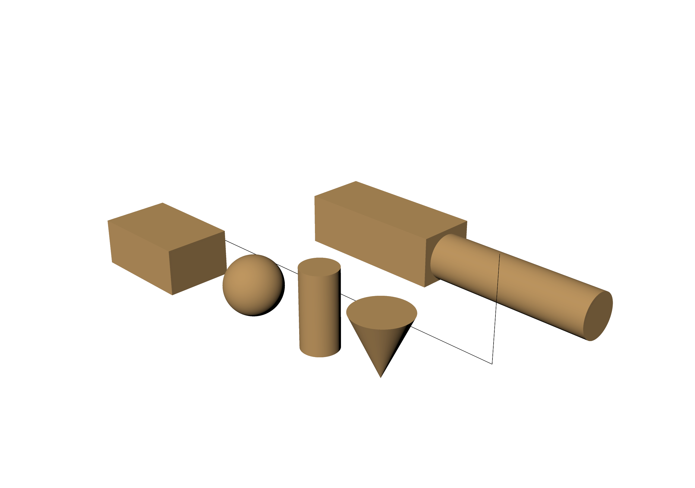

# Geometry, layers, materials

<!-- run: 2026-08-30, plugin 0.4.0, RhinoAndGHFiles/guide_shapes.3dm -->

| task | mcp | rhino command |
| --- | --- | --- |
| create geometry | `create_objects(objects=[{"type": "BOX", ...}])` | the drawing commands |
| copy | `copy_objects(objects=[{"id": ..., "translation": [0, -400, 0]}])` | `Copy` |
| rename, recolour, move, scale, hide | `modify_objects(objects=[{...}])` | `Properties`, `Move`, `Scale` |
| delete | `delete_objects(names=["POST"], confirm=True)` | `Delete` |
| new layer | `create_layer(name="GUIDE", color=[200, 80, 40])` | `Layer` |
| rename or delete a layer | `rename_layer(id=..., new_name=...)`, `delete_layer(name=...)` | `Layer` |
| read or set the current layer | `get_or_set_current_layer(name="GUIDE")` | `Layer` |
| move objects to a layer | `move_objects_to_layer(ids=[...], layer="GUIDE")` | `ChangeLayer` |
| layer visibility and locks | `get_layer_states()` | `Layer` |
| remember and restore them | `save_layer_state(name="all on")`, `restore_layer_state(name="all on")` | `LayerStateManager` |
| materials in the document | `get_materials()` | `Materials` |
| a new material | `create_material(name="guide oak", r=190, g=150, b=96)` | `Materials` |
| assign one | `set_object_material(ids=[...], material_index=0)` | `Properties` |
| what is assigned | `get_object_materials(ids=[...])` | `Properties` |



The image shows `RhinoAndGHFiles/guide_shapes.3dm`, built by
[`scripts/dev/build_guide_images.py --build-shapes`](../../scripts/dev/build_guide_images.py)
out of the calls on this page.

## Creating

One call creates many objects. Each entry is a `type`, a `params` block for that type, and
optional placement and attributes:

```python
create_objects(objects=[
    {"type": "BOX", "name": "BLOCK", "params": {"width": 400, "length": 260, "height": 180},
     "translation": [0, 0, 90], "color": [176, 176, 176]},
    {"type": "CYLINDER", "name": "LAID_POST",
     "params": {"radius": 90, "height": 700, "cap": True, "axis": "x"},
     "translation": [1140, 700, 90]},
    {"type": "POLYLINE", "name": "PATH",
     "params": {"points": [[-200, 320, 0], [1340, 320, 0], [1340, 320, 400]]}},
])
```

| type | params |
| --- | --- |
| `POINT` | `x`, `y`, `z` |
| `LINE` | `start`, `end` |
| `POLYLINE` | `points` |
| `CURVE` | `points`, `degree` |
| `CIRCLE` | `center`, `radius` |
| `ARC` | `center`, `radius`, `angle` (degrees) |
| `ELLIPSE` | `center`, `radius_x`, `radius_y` |
| `BOX` | `width` (x), `length` (y), `height` (z) |
| `SPHERE` | `radius` |
| `CYLINDER` | `radius`, `height`, `cap`, `axis` (`x`, `y` or `z`) |
| `CONE` | `radius`, `height`, `cap`, `axis` |
| `SURFACE` | `points`, `count` as `[u_count, v_count]` |

Solids are created at the origin and then placed. Boxes use `Plane.WorldXY`; cylinders and
cones place the midpoint of their axis at the origin. Therefore, `translation` specifies the
centre rather than a corner. The 180 mm box above sits on z = 0 because its centre is
translated upward by half its height.
`rotation_matrix` (3x3, world axes), `scale` and `color` apply at creation;
`name` is what the response is keyed by, and what `names=` selectors match later.

Curves and circles are created on the world plane. New objects are placed on the current layer.

## Copying, changing, deleting

```python
copy_objects(objects=[{"id": "...", "translation": [0, -400, 0]}])   # {"copied": 1}
modify_objects(objects=[{"id": "...", "new_name": "BALL2", "translation": [0, -300, 0]}])
delete_objects(names=["RING"], confirm=True)      # {"count": 1}
```

`modify_objects` takes `new_name`, `new_color`, `layer`, `translation`, `rotation_matrix`
(pivot at the object's bounding-box centre), `invert_rotation_matrix`, `scale` and `visible`,
per object, and `all=True` to apply one entry to every object. It reports what actually
changed:

```text
{"modified": 1, "updates": [{"id": "a934e842-...", "name": "BALL2",
   "updated": {"pose": {"world_from_local": {"R": [[1.0, 0.0, 0.0], [0.0, 1.0, 0.0], [0.0, 0.0, 1.0]],
                                             "t": [520.0, -300.0, 110.0]}},
               "position": [520.0, -300.0, 110.0], "name": "BALL2"},
   "changed_fields": ["pose", "position", "name"]}]}
```

`delete_objects` requires `confirm=True`. Names must be unique in the document; if two objects
are named `POST`, the operation fails with:

```text
Multiple objects with name POST found.
```

A transform through `modify_objects` or `rotate_objects` recomputes the object's detected
pose, so its oriented box stays minimal; a pose that was set deliberately with
`rebase_objects_pose` is kept instead ([04](04-pose-transforms.md)).

## Layers

```python
create_layer(name="GUIDE", color=[200, 80, 40])   # {"id": "00f90bef-...", "name": "GUIDE", ...}
get_or_set_current_layer(name="GUIDE")            # sets it; no argument reads it
move_objects_to_layer(ids=["..."], layer="GUIDE") # {"message": "Moved 1 object(s) to layer.", "count": 1}
rename_layer(id="00f90bef-...", new_name="GUIDE 2")
delete_layer(name="GUIDE 2")
```

`create_layer` takes an optional `parent` layer name. `delete_layer` and
`get_or_set_current_layer` take either `name` or `guid`; `rename_layer` takes the id only.

Layers also affect stability evaluation. Mass can be assigned from layer density, and
joint-type rules can apply to layer pairs ([07](07-mass-joint-types.md)). An element's layer
can therefore determine how it is evaluated.

```python
get_layer_states()
```

```text
{"layers": [{"index": 0, "name": "SHAPES", "visible": true, "locked": false, "color": "0,0,0"}], "count": 1}
```

```python
save_layer_state(name="all on")
restore_layer_state(name="all on")
```

Saved layer states are stored in plugin memory and are lost when Rhino or the plugin restarts.
Named views are stored in the `.3dm` ([05](05-views-capture.md)).

## Materials

```python
material = create_material(name="guide oak", r=190, g=150, b=96)   # {"message": ..., "index": 0}
set_object_material(ids=[...], material_index=0)
get_object_materials(ids=[...])
get_materials()
```

Only diffuse colour is supported. `create_material` returns the material index. Prefer
`material_index` when assigning a material because `material_name` is ambiguous if names are
duplicated.

```text
{"objects": [{"id": "2384a0d0-...", "name": "CAP", "material_index": 0, "material_name": "guide oak"},
             {"id": "4f743462-...", "name": "PATH", "material_index": -1, "material_name": "ByLayer"}],
 "count": 2}
```

`material_index` -1 means `ByLayer`, with no material assigned directly to the object. Materials
appear in a capture taken in the `Rendered` display mode; `Shaded` uses the display mode's colour
([05](05-views-capture.md)).
