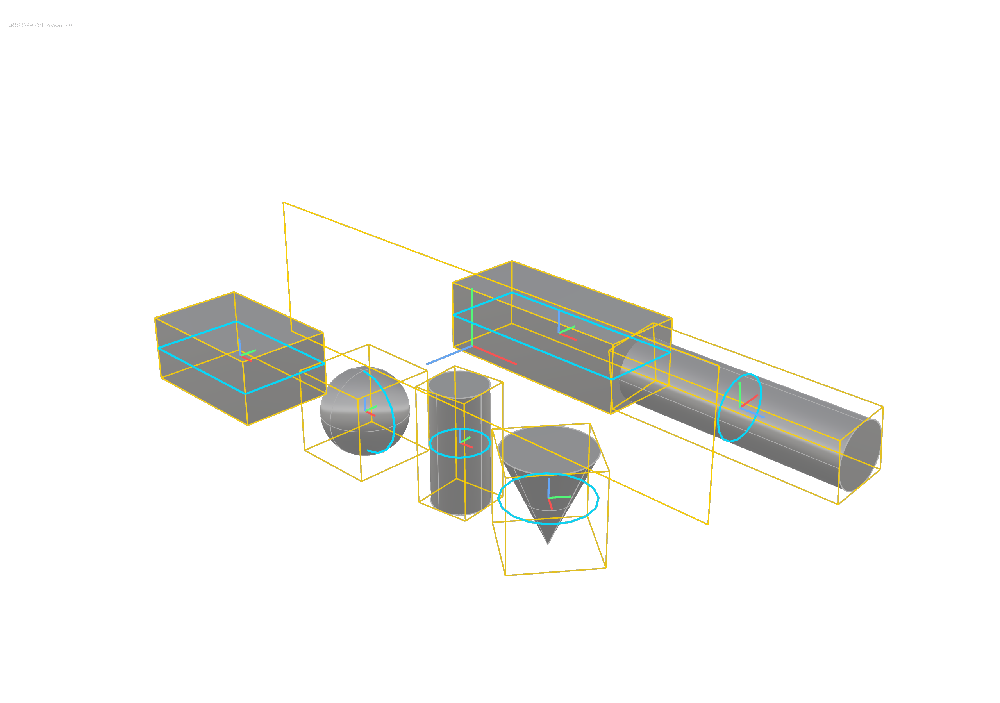

# Pose and transforms

<!-- run: 2026-08-30, plugin 0.4.0, RhinoAndGHFiles/guide_shapes.3dm -->

| task | mcp | rhino command |
| --- | --- | --- |
| read an object's pose | `get_object_info(name="TURNED_BLOCK")` | `What` |
| rotate about a pivot | `rotate_objects(objects=[{"id": ..., "rotation_matrix": R, "pivot": [0, 0, 0]}])` | `Rotate3D` |
| undo a rotation | `invert_rotation_matrix(rotation_matrix=R)`, then rotate by the inverse | `Undo` |
| put objects back where they started | `reset_objects_pose(objects=[{"id": ...}])` | - |
| take the current placement as the canonical one | `rebase_objects_pose(objects=[{"id": ...}])` | - |
| draw the boxes and profiles | - | `mcpmodobb` |
| forget the stored poses and boxes | - | `mcpmodclearcache` |

A pose defines the coordinate frame used to describe an object's geometry. `world_from_local`
contains a 3x3 rotation `R` and a translation `t`. An oriented box reports extents in this
local frame, and pose operations use the same transform to place, measure, and reset the
object.



## Where the pose comes from

The plugin detects a pose from the geometry, such as the tightest box around an extrusion or
the plane containing a polyline. It stores the result on the object so subsequent reads return
the same pose:

| user string | holds |
| --- | --- |
| `rhinomcp.pose.v1` | the pose, `R` and `t` |
| `rhinomcp.pose.mode.v1` | `detected` or `explicit` |
| `rhinomcp.obb.v1` | the corresponding oriented box |

A transform through `modify_objects` or `rotate_objects` recomputes a `detected` pose to keep
the box minimal. An `explicit` pose set by `rebase_objects_pose` is transformed with the object
instead of being recomputed. `mcpmodclearcache` deletes all three values; the next read detects
a new pose.

## Rotating

```python
rotate_objects(objects=[{
    "id": "...",
    "rotation_matrix": [[0.866, -0.5, 0.0], [0.5, 0.866, 0.0], [0.0, 0.0, 1.0]],
    "pivot": [0, 0, 0],
}])
```

```text
{"rotated": 1, "updates": [{"id": "faee3c94-...", "name": "BLOCK",
   "updated": {"pose": {"world_from_local": {"R": [[0.866019, -0.500011, 0.0],
                                                   [0.500011, 0.866019, -0.0],
                                                   [0.0, 0.0, 1.0]],
                                             "t": [-0.0, -0.0, 90.0]}},
               "position": [-0.0, -0.0, 90.0]},
   "changed_fields": ["pose", "position"]}]}
```

The matrix uses world axes, and the required `pivot` is the world point about which the object
rotates. Omitting it returns `Missing pivot`. `all=True` applies one entry to every object.
`modify_objects` accepts the same `rotation_matrix` but always rotates about the object's
bounding-box centre. Use `rotate_objects` when the pivot must be specified.

To undo one, invert it and rotate again about the same pivot:

```python
invert_rotation_matrix(rotation_matrix=[[0.866, -0.5, 0.0], [0.5, 0.866, 0.0], [0.0, 0.0, 1.0]])
# {"inverse_rotation_matrix": [[0.866, 0.5, 0.0], [-0.5, 0.866, 0.0], [0.0, 0.0, 1.0]]}
```

For a proper rotation, the inverse is the transpose, which is what the tool returns. Passing
`invert_rotation_matrix=True` alongside a `rotation_matrix` in `rotate_objects` or
`modify_objects` performs the same operation inline. Pass the object's current pose `R` to
align the object with the world axes.

## Reset and rebase

```python
reset_objects_pose(objects=[{"id": "..."}])
```

```text
{"reset": 1, "updates": [{"id": "faee3c94-...", "name": "BLOCK",
   "updated": {"pose": {"world_from_local": {"R": [[1.0, 0.0, -0.0], [-0.0, 1.0, 0.0], [0.0, 0.0, 1.0]],
                                             "t": [0.0, 0.0, 0.0]}},
               "position": [0.0, 0.0, 0.0]},
   "changed_fields": ["pose", "position"]}]}
```

Reset moves the object to the identity rotation and the origin. For each object,
`reset_rotation` and `reset_translation` select which components to reset; both default to
true. `target_translation` specifies a destination other than the origin. For example,
`{"reset_rotation": True, "reset_translation": False}` resets the orientation without moving
the object.

```python
rebase_objects_pose(objects=[{"id": "...", "z_direction": "+z", "x_direction": "+x"}])
```

Rebase does not move the object. It sets the current placement as the canonical pose, anchors
the translation at the current bounding-box centre, and marks the pose `explicit` so later
transforms preserve it instead of detecting a new one. The orientation is taken from the
object's current pose frame; `z_direction` (`+z`, `-z`) and `x_direction` (`+x`, `-x`, `+y`,
`-y`) resolve it to the nearest signed axis permutation, which is how to pin down which way
"up" and "along" are for a member whose detected frame is one of several equally tight ones.
Without these hints, the returned frame can be a signed permutation of the input frame. The
box is unchanged, but the axes are labelled differently. Specify the hints when axis direction
has semantic meaning.

Together, the operations provide a placement workflow: rebase a component in its authored
orientation, transform it into position, and use `reset_objects_pose` to return it to the
authored placement rather than the world origin.

<a id="the-overlay"></a>

## OBB overlay

`mcpmodobb` draws what the stored poses and boxes say, for every object:

```text
mcpmodobb            with no option, toggles
mcpmodobb On
mcpmodobb Off
mcpmodobb Status     prints "MCP OBB is ON." or "MCP OBB is OFF."
```

`run_rhino_command("mcpmodobb On")` passes the option token. The overlay draws the oriented
box in yellow, the pose axes at its origin, and the projection profiles on the box faces. The
profiles are the silhouettes returned by `geometry_detail="ortho3"`
([02](02-scene-inspection.md)). Use the overlay to verify that the box fits the member and its
frame has the intended orientation before using pose-based measurements.

The overlay has no MCP equivalent, and reading or setting a pose has no Rhino command
equivalent.
