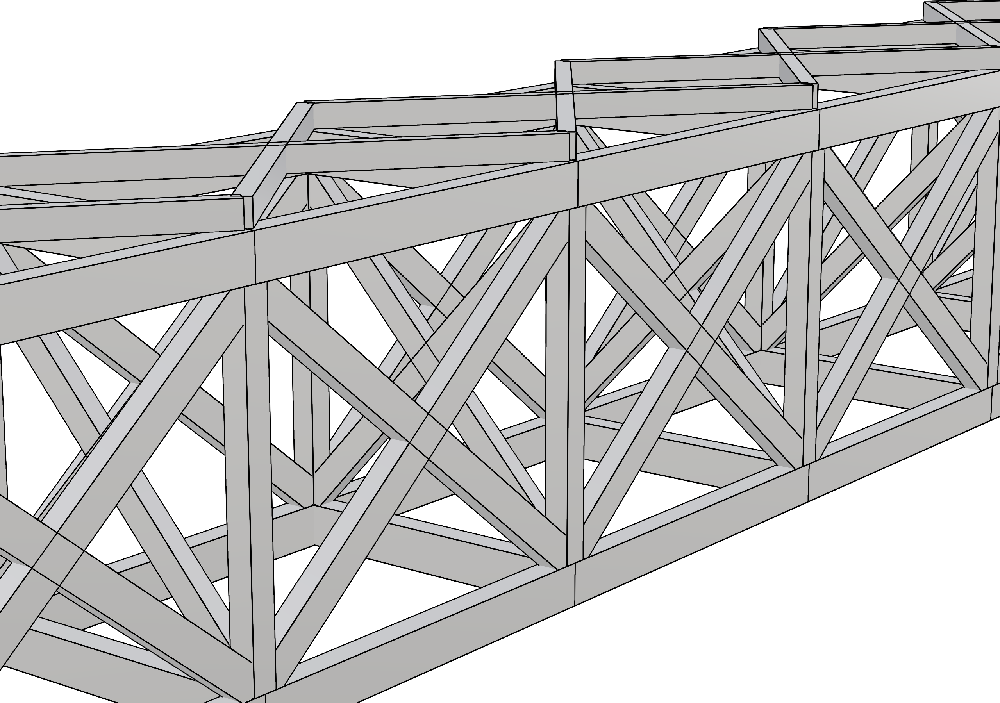
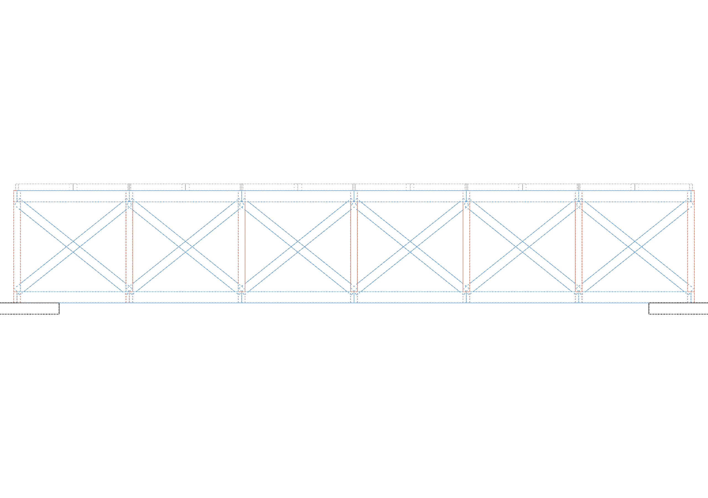

# Views and capture

<!-- run: 2026-08-29, plugin 0.3.1, RhinoAndGHFiles/timber_bridge.3dm and timber_bridge_xbraced.3dm -->

| task | mcp | rhino command |
| --- | --- | --- |
| a picture of everything | `capture_view(all_visible=True)` | `ViewCaptureToFile` |
| a picture of some objects | `capture_view(ids=[...])`, `selected=True` | select, then `ViewCaptureToFile` |
| from a standard direction | `capture_view(view="front")` | `Front`, `Zoom Extents` |
| from a stated camera | `capture_view(camera_location=[...], camera_target=[...], lens_mm=85)` | `Viewport Properties` |
| in another display mode | `capture_view(display_mode="Technical")` | the mode's own command |
| bigger | `capture_view(resolution="print")`, `width=`, `height=` | `ViewCaptureToFile` |
| on white | `capture_view(background="white")` | - |
| what the viewports are doing | `get_viewport_info()` | `ViewportProperties` |
| zoom the real viewport | `zoom_to_objects(ids=[...])` | `Zoom Selected` |
| save, restore, delete a named view | `save_named_view(name=...)`, `restore_named_view(name=...)`, `delete_named_view(name=...)` | `NamedView` |
| list named views | `get_named_views()` | `NamedView` |

`capture_view` returns the PNG as base64 in `png_base64`, together with a `metadata` block. It
does not write a file. By default, it restores the active viewport after the capture.

## Framing

```python
capture_view(all_visible=True, view="isometric")
capture_view(ids=["...", "..."], view="top")
capture_view(selected=True, view="front", padding=1.4)
capture_view(view="perspective", fit=False)          # keep the camera where it is
```

Set the target with `ids`, `selected=True`, or `all_visible=True`. If none is supplied, the
current viewport is captured without selecting a target. `view` accepts `perspective`,
`isometric`, `top`, `front`, or `right`; the first two are perspective views and the remaining
three are parallel. `fit` defaults to true and frames the targets. `padding` defaults to 1.15
and has a minimum value of 1.0.

An explicit camera overrides the preset. Both ends are required, and it is always
perspective:

```python
capture_view(all_visible=True, fit=False,
             camera_location=[-9000, -14000, 7000], camera_target=[9000, 0, 1500],
             lens_mm=85)
```



`lens_mm` is the 35 mm-equivalent focal length. Presets use 50 mm and do not inherit a lens
from a parallel viewport. Use `camera_up` to control camera roll. Set `fit=False` to prevent
automatic framing from changing the explicit camera.

## Display modes and background

```python
capture_view(all_visible=True, view="front", display_mode="Technical")
```



`display_mode` is any Rhino display mode name - `Shaded`, `Rendered`, `Wireframe`,
`Technical`, `Arctic`, `Ghosted`. `Rendered` is the one that shows assigned materials
([03](03-geometry-layers-materials.md)); `Shaded` shows the display mode's own object colour.

`background` accepts `viewport`, `white`, or `transparent`. The default, `viewport`, uses the
display mode's background. A mode that fills objects with white, including the default
`Shaded` mode on macOS, may show only edges against a white background. Change the mode's
object colour or use `Arctic` to retain surface shading.

`draw_grid` and `draw_axes` are off by default, so a capture is the model and not the
construction plane.

Display conduits are drawn in every case: the connectivity graph overlay
([06](06-connectivity-graph.md)), the settled pose ([08](08-stability.md)) and the OBB
overlay ([04](04-pose-transforms.md)) all appear in a capture if they are on.

## Size

| resolution | pixels |
| --- | --- |
| `low` | 640 x 480 |
| `medium` | 960 x 720 (default) |
| `high` | 1280 x 900 |
| `print` | 2560 x 1800 |

`width` and `height` override the preset, clamped to 256..3840 and to about 8.3 megapixels
in total. Screen-space items, including overlay text, node markers, and line widths, scale with
the capture. A `print` capture therefore retains readable labels. The PNG is returned over the
socket as base64 and is roughly one megabyte at `print` size.

<a id="what-comes-back"></a>

## Capture response

```text
{"png_base64": "iVBORw0KGgo...",
 "metadata": {"view": "front", "target_mode": "all_visible", "display_mode": "Technical",
              "width": 2560, "height": 1800,
              "camera_location": [12000.0, -3730.635217, 1520.0],
              "camera_target": [12000.0, 0.0, 1520.0], "camera_up": [0.0, 0.0, 1.0],
              "lens_mm": null, "projection": "parallel", "preserve_view": true,
              "object_count": 90, "objects": [{"id": "...", "name": "BOT_0_00", "type": "Brep"}, ...],
              "bbox": {"min": [-1500.0, -2000.0, -800.0], "max": [25500.0, 2000.0, 3840.0]}}}
```

The camera fields record the values used for the capture. To reproduce an automatically framed
capture, pass them back as `camera_location`, `camera_target`, and `lens_mm` with `fit=False`.
`lens_mm` is null for a parallel projection.

`preserve_view` defaults to true and restores the camera, projection, lens, frustum, and
display mode after the capture. Set it to false to retain the captured view in Rhino.

<a id="the-real-viewports"></a>

## Viewport state

```python
get_viewport_info()
```

```text
{"viewports": [{"id": "1dd48cc7-...", "name": "Perspective", "active": true,
                "projection": "perspective", "lensMm": 50.0, "displayMode": "Shaded",
                "cameraLocation": "2632.94,-1932.94,1901.41",
                "cameraTarget": "904.17,-204.17,777.71"},
               {"name": "Top", "active": false, "projection": "parallel",
                "lensMm": null, "displayMode": "Wireframe", ...}]}
```

`displayMode` reports the mode currently shown in Rhino. `capture_view` can temporarily use a
different mode without changing this state when `preserve_view=True`.

```python
zoom_to_objects(ids=["..."])     # or nothing, for the current selection
```

`zoom_to_objects` changes the active Rhino viewport and leaves it changed. `capture_view`
instead produces an image and restores the viewport by default.

## Named views

```python
save_named_view(name="guide iso")        # the active viewport's camera, or viewport="Front"
get_named_views()
restore_named_view(name="guide iso")     # into the active viewport, or viewport=
delete_named_view(name="guide iso")
```

```text
{"named_views": [{"index": 0, "name": "guide iso", "projection": "perspective", "lensMm": 50.0,
                  "cameraLocation": "2632.94,-1932.94,1901.41",
                  "cameraTarget": "904.17,-204.17,777.71"}], "count": 1}
```

Named views are stored in the document and saved with the file. Saved layer states remain only
for the plugin session ([03](03-geometry-layers-materials.md)). Saving a named view with an
existing name replaces the previous definition.
