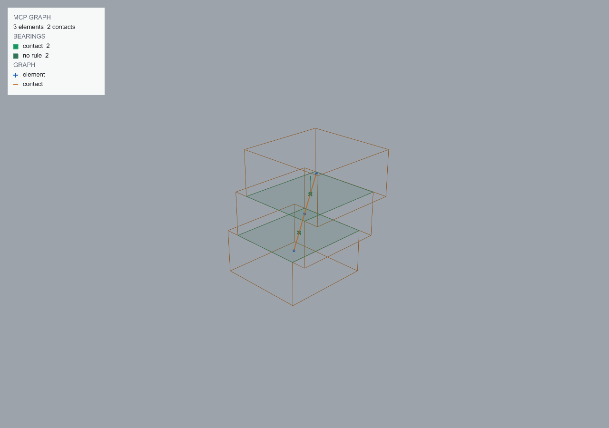

# Connectivity graph

<!-- run: 2026-08-29, plugin 0.3.1 -->

| task | mcp | rhino command |
| --- | --- | --- |
| the graph as data | `get_connectivity_graph()` | `mcpmodgraphexport` |
| the graph for a subset | `get_connectivity_graph(layer="TRUSS")`, `ids=`, `bbox=`, `selected=True` | pre-select, then `mcpmodgraph` |
| draw it | `graph_display(enabled=True)` | `mcpmodgraph` (`All` for the whole document) |
| draw a subset only | `graph_display(enabled=True, ids=[...])` | pick at the prompt |
| hide it | `graph_display(enabled=False)` | `mcpmodgraph Off` |
| what is currently drawn | `graph_display()` | - |
| write it to a file | - | `mcpmodgraphexport <path>` |
| discard the stored graph | - | `-mcpmodclearcache` |

The connectivity graph records which elements touch and where they meet. Each node represents
an object. Each edge represents two objects within the contact gap and includes the contact
point and measured bearing surface. The stability evaluator uses this graph
([08](08-stability.md)); inspect the overlay before evaluation to verify the detected contacts.

## Data

```python
get_connectivity_graph()                        # whole document
get_connectivity_graph(layer=["TRUSS", "PAD"])  # these layers
get_connectivity_graph(ids=[...])
get_connectivity_graph(bbox=[[0, 0, 0], [12000, 4000, 4000]], bbox_mode="intersects")
get_connectivity_graph(selected=True)
```

```text
{"n": [{"i": 0, "name": "STAIR_0", "guid": "..."}, {"i": 1, "name": "STAIR_1", "guid": "..."}, ...],
 "e": [[0, 1, [350.0, 300.0, 300.0]], [1, 2, [450.0, 300.0, 600.0]]],
 "node_count": 3, "edge_count": 2, "candidate_count": 3, "examined_count": 3,
 "node_limit": 20000, "truncated": false, "source": "computed", "tol": 0.005}
```

`e` is undirected and stores `[i, j, contact point]`, where `i` and `j` index `n`. Filters
combine with AND. The result includes connected components and nearby unattached objects, so
an element with no contacts appears as a node with no edges.

If `truncated` is true, candidates beyond `node_limit` were not tested and missing edges are
not conclusive. Narrow the scope and run the query again.

`source` identifies how the result was obtained. The graph is stored on the document under
`rhinomcp-mod:connectivity-graph` with a fingerprint of the geometry it was computed from
(object ids, quantised bounding boxes, and tolerance). While the fingerprint matches, the stored
graph is returned (`document_text_cache`, or `memory_cache` when the same session already
built it); otherwise, it is recomputed (`computed`). Editing an element invalidates the cache.
Changes to the plugin's measurement implementation do not, so use `-mcpmodclearcache` after
upgrading measurement behaviour.

Contact detection works in multiples of the document's absolute tolerance, so a document
whose tolerance is coarse finds contacts a fine one would not.

## Overlay

```python
graph_display(enabled=True)                  # draw what get_connectivity_graph would return for the whole document
graph_display(enabled=True, layer="TRUSS")   # pin the overlay to a scope
graph_display()                              # report: enabled, scope, object count
graph_display(enabled=False)
```



What is drawn:

- an asterisk at each node's centre; a hollow circle for a node with no edges
- each edge as two segments through the contact point, showing the contact location
- the bearing at each contact, in the colour of the joint type it will be solved as: contact
  green, pin blue, fixed amber. Bearings matched by a rule are bright; bearings using the
  default are dim
- a short normal on each bearing, the direction it pushes
- a line where two faces cross without overlapping, drawn thick: a hinge about itself
- the readout: elements and contacts, joint types by count, how many joints took the default,
  and how many bearings were lines, sampled, or unmeasured

A bearing drawn on a vertical face beneath a supported member, or a support with more patches
than supported members, can indicate that contact detection retained the wrong face
([08 - limitations](08-stability.md#limitations)).

In Rhino, `mcpmodgraph` prompts for objects (Enter with a pre-selection uses it; `All` is the
whole document; `Off` hides the overlay) and pins that scope: a later `graph_display()` or
`mcpmodevaluatestability` > `Pinned` reuses it.

## Export

`mcpmodgraphexport` writes the current graph as JSON to a path it asks for;
`run_rhino_command("mcpmodgraphexport /path/to/graph.json")` passes it. The file is the same
shape as `get_connectivity_graph` returns.
