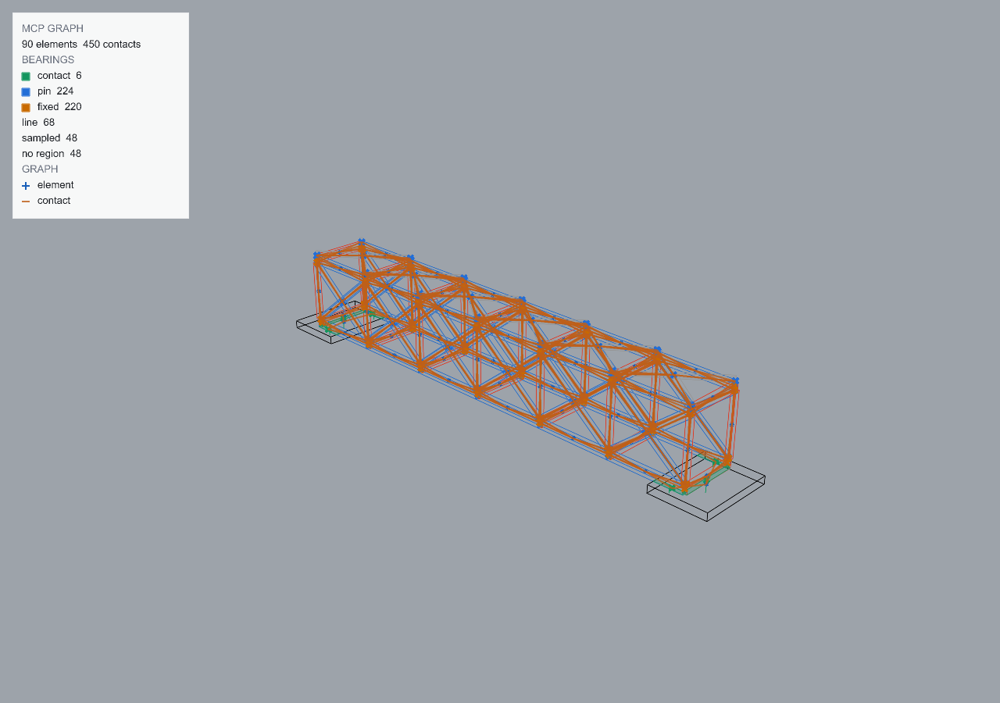

# Mass and joint types

<!-- run: 2026-08-30, plugin 0.4.0 -->

| task | mcp | rhino command |
| --- | --- | --- |
| mass from density and volume | `assign_mass(density=2400, layer="Blocks")` | `mcpmodassignlayerdensity`, then `mcpmodmassfromlayerdensity` |
| one mass per object | `assign_mass(mass=120, ids=[...])` | `mcpmodassignmass` |
| only where none is set | `assign_mass(density=2400, overwrite=False)` | `mcpmodassignmissingmass` |
| store a density on a layer | - | `mcpmodassignlayerdensity` |
| rule for a layer pair | `assign_joint_type(joint_type="pin", layer="TRUSS", with_layer="TRUSS")` | `mcpmodassignjointtype` > Layers |
| rule for two elements | `assign_joint_type(joint_type="contact", ids=[a], with_ids=[b])` | `mcpmodassignjointtype` > Objects |
| an element's own joints | `assign_joint_type(joint_type="pin", ids=[a])` | `mcpmodassignjointtype` |
| a founded base | `assign_joint_type(joint_type="fixed", layer="PAD", with_ground=True)` | `mcpmodassignjointtype` |
| tension capacity on a rule | `assign_joint_type(..., capacity_kn=40)` | `mcpmodassignjointtype` |
| list the rules | `assign_joint_type()` | `mcpmodassignjointtype` > List |
| drop rules naming nothing | `assign_joint_type(prune=True)` | `mcpmodassignjointtype` > Prune |
| remove every rule | `assign_joint_type(clear=True)` | `mcpmodassignjointtype` > Clear |

## Mass

Every element in the evaluation scope must have a positive mass. Mass is stored on the object
under `rhinomcp.stability.v1` in kilograms, regardless of document units, and is preserved when
the object is copied.

```python
assign_mass(density=2400, layer="Blocks")     # kg/m³ here; each object's mass from its own closed volume
assign_mass(mass=850, names=["SLAB"])         # kg, the same value on every object in the scope
assign_mass(density=500, overwrite=False)     # fill in what has no mass yet, leave the rest
```

Provide exactly one of `density` or `mass`. Define the scope with `ids`, `names`, `layer` (one
or a list), or `selected`; omitting the scope selects the whole document. The result lists
each object's mass and source volume, the total mass, the input value and unit, and `skipped`.
Objects are skipped when a density is supplied but no closed volume can be computed; assign
those objects an explicit mass.

```text
{"assigned": [{"guid": "...", "name": "BOT_0_01", "mass": 259.2, "mass_unit": "kg", "volume_m3": 0.108}, ...],
 "skipped": [], "total_mass_kg": 37231.4, "density_kg_m3": 2400, "input_value": 2400, "input_unit": "kg/m³",
 "document_length_unit": "Millimeters", "document_density_unit": "kg/m³"}
```

The Rhino commands prompt per object or per layer. In a metric document they take `kg` and
`kg/m³`; in an imperial one, pound-mass (`lbm`, never pound-force) and `lbm/ft³`. Either way
the stored value is kilograms.

```text
mcpmodassignlayerdensity          Layer: Blocks   Density (kg/m³): 2400
mcpmodmassfromlayerdensity        every object on a layer with a density gets density x volume
mcpmodassignmass                  pick objects; Mass for BOT_0_01 in kg <259.2>:
mcpmodassignmissingmass           the same, only for objects with no mass
```

### Imperial documents

Density and mass inputs use the document's units. `get_document_info` reports these units
alongside the length unit ([02](02-scene-inspection.md)); check them before selecting a value:

```text
"meta_data": {..., "units": "Inches", "mass_unit": "lbm", "density_unit": "lbm/ft³"}
```

| document | `density` | `mass` | stored |
| --- | --- | --- | --- |
| Millimeters, Meters, ... | kg/m³ | kg | kg |
| Inches, Feet, ... | lbm/ft³ | lbm | kg |

```python
# Inch document. 150 lbm/ft³ is read as such and stored as 2403 kg/m³ of concrete.
assign_mass(density=150, layer="Blocks")
assign_mass(mass=1874, names=["SLAB"])       # lbm; stored as 850 kg
```

Imperial mass values use pound-mass, not pound-force. The response reports the interpreted
input unit and the document unit so unit mismatches are visible:

```text
{"input_value": 150, "input_unit": "lbm/ft³", "density_kg_m3": 2402.8,
 "document_length_unit": "Inches", "document_density_unit": "lbm/ft³"}
```

Only the input unit follows the document. Volume is computed from the geometry and converted
automatically, and stored mass remains in kilograms. Equivalent models built in inches and
millimetres therefore use the same canonical mass during evaluation.

## Joint types

Geometry alone cannot distinguish a screwed connection from dry contact. Assign a joint type
to describe the connection. The type determines how the measured bearing
([06](06-connectivity-graph.md)) is used:

| type | carries | example |
| --- | --- | --- |
| `contact` | compression and moment until it opens; friction across it; no tension | dry masonry, a beam on a corbel, a panel on a pad |
| `pin` | force in three directions, no moment | truss to truss, a single bolt |
| `fixed` | force and moment, both ways, always | a moment connection: beam to column, a rigid plate |

The moment comes from the spread of the bearing. A joint reduced to a point has no lever arm
and resists no rotation, so `pin` collapses the bearing to its centre and the other two keep
its extent.

An unmatched joint defaults to `contact`, which represents two detected surfaces touching.
`fixed` is the strongest available assumption. `pin` carries tension but reduces the bearing
to a point, so applying it to a stack of blocks creates point hinges not represented by the
physical bearing surfaces.



## Rules

Rules are stated by element class, not joint by joint, and stored in the document under
`rhinomcp.stability.joint_types.v1`:

```python
assign_joint_type(joint_type="pin", layer="TRUSS", with_layer="TRUSS")       # every truss-to-truss joint
assign_joint_type(joint_type="contact", layer="TRUSS", with_layer="PAD")     # truss on pad
assign_joint_type(joint_type="fixed", layer="BEAM", with_layer="PORTAL", capacity_kn=40)
assign_joint_type(joint_type="contact", ids=[block], with_ids=[pad])         # one joint
assign_joint_type(joint_type="pin", ids=[strut])                             # all of one element's joints
assign_joint_type(joint_type="fixed", layer="PAD", with_ground=True)         # a founded base
```

Layer rules match the layer's leaf name, not its full path. Element rules (an `ids` list with
no `with_`) are stored on the object beside its mass.

Pair rules take precedence over element rules, which take precedence over the default. If two
element rules disagree, the weaker joint type applies. This produces a more flexible model
when the connection is ambiguous. The result includes each joint's resolved type and the rule
that selected it (`nodes[].joint_type`, `nodes[].joint_type_rule`;
[09](09-reading-results.md)).

**Founded bases.** A base resting on the floor uses a contact bearing and can lift or slide.
Geometry cannot distinguish a pad cast into a footing from one placed on gravel. Use
`with_ground=True` to define a fixed or pinned ground connection when required. Without that
rule, an arch can spread at its springings and a post under an overhanging load can lift one
edge of its base.

**Capacity.** `capacity_kn` limits tension at each bearing point, giving the joint both axial
and moment capacity. When the limit is reached, tension remains at the limit while the
structure redistributes or moves; the joint is not removed. Compare capacity against
`peak_point_tension_n`, not net force. For example, a cantilever connection can have -7.1 kN
net compression while one bearing point carries 24.5 kN of tension.

## List, prune, clear

```python
assign_joint_type()                 # every rule, with "stale" on any that names an object or layer no longer in the document
assign_joint_type(prune=True)       # remove the stale ones and return them
assign_joint_type(clear=True)       # remove every rule
```

```text
{"rules": [{"a": "layer:PAD", "b": "layer:TRUSS", "joint_type": "contact", "capacity_kn": null},
           {"a": "layer:TRUSS", "b": "layer:TRUSS", "joint_type": "pin", "capacity_kn": null},
           {"a": "id:15ee9192-...", "b": "id:282f4823-...", "joint_type": "contact",
            "stale": "object 15ee9192-... is not in the document; object 282f4823-... is not in the document"}],
 "stale_rules": 1}
```

A rule that names a deleted object is retained so undoing the deletion also restores its use.
Stale rules match nothing and do not affect the verdict. The evaluation prompt reports their
count, for example `4 rules, 2 stale`. Use `prune` to remove them.

In Rhino, `mcpmodassignjointtype`:

```text
Select elements on one side of the joint ( List  Prune ): <pick, or List / Prune>
Select elements on the other side ( Ground ): <pick, or Ground for a founded base>
Write the rule about ( Layers  Objects ): Layers
Joint type ( Contact  Pin  Fixed  Clear ): Pin
```

`Layers` writes one rule for the two layers the picks are on; `Objects` writes one rule per
object pair. `Clear` removes the rule for that pair.
