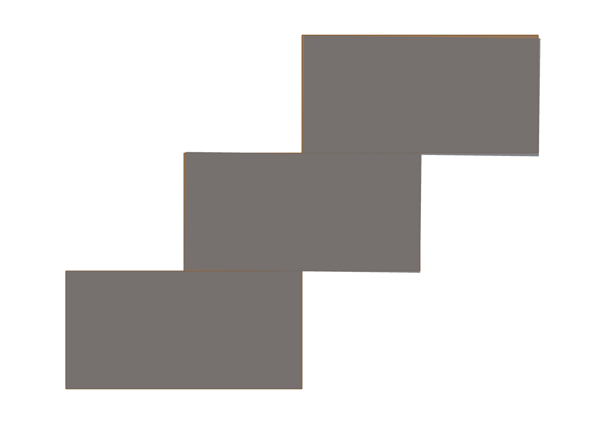

# Stability evaluation

<!-- run: 2026-08-30, plugin 0.4.0 -->

| task | mcp | rhino command |
| --- | --- | --- |
| elements as separate bodies, joined where they bear | `evaluate_stability(mode="elements")` | `mcpmodevaluatestability` > Elements |
| the scope as one rigid body: does it tip or slide | `evaluate_stability(mode="assembly")` | `mcpmodevaluatestability` > Assembly |
| default type for joints no rule names | `evaluate_stability(mode="elements", joint_type="pin")` | the `Joint type where no rule names one` prompt |
| a subset | `evaluate_stability(mode="elements", ids=[...])`, `layer=`, `bbox=`, `selected=True` | pre-select, or pick at the first prompt |
| measure sway stiffness too | `evaluate_stability(mode="elements", lateral_load_fraction=0.05)` | Custom > `Sway probe` |
| see the settled pose | `evaluate_stability(mode="elements", display=True)` | `mcpmodstabilitydisplay On` |
| the whole report in one answer | `evaluate_stability(mode="elements", detail="full")` | - |

Stability evaluation applies gravity to the selected geometry and reports whether it remains
stable. Depending on the mode, the solver treats the selection as one rigid body or as separate
bodies connected at detected contacts. It can identify whole-assembly tipping and sliding,
internal mechanisms, and elements rotating off their supports. Rhino 8 with Grasshopper is
required; the plugin loads Rhino's `KangarooSolver.dll` for assembly mode.

Before evaluation, assign mass to every element and add joint rules where the default is not
appropriate ([07](07-mass-joint-types.md)). Inspect the connectivity graph
([06](06-connectivity-graph.md)). Contacts missing from the graph are not evaluated, and a
bearing measured on the wrong face can restrain the wrong rotation.

## Modes

`mode` determines how the selected geometry is divided into rigid bodies. Joint behaviour is
configured separately for each connection ([07](07-mass-joint-types.md)).

| mode | bodies | joints | answers |
| --- | --- | --- | --- |
| `assembly` | the whole scope as one body | none | whether the assembly tips or slides as a whole |
| `elements` | one per element | the assigned type at each connection; `contact` by default | whether the model contains a mechanism, how far it moves, and how stiff it is |

The modes answer different questions. `assembly` treats the geometry as one rigid body,
effectively making all internal connections rigid, and therefore cannot detect internal
mechanisms. It provides a quick upper-bound check and reports the closed-form
`support_margin_m`, which compares the centre of mass with the bearing footprint. `elements`
can detect internal mechanisms, but the result depends on the assigned joint types. A pin
carries tension, so an element cannot topple off a pinned connection as it can from a contact
bearing. Use both modes when whole-assembly stability and internal behaviour are relevant.

`assembly` does not model each connection as a separate fixed joint. It creates one body and
therefore has no internal joints.

```python
evaluate_stability(mode="assembly")                        # one body; tips or not
evaluate_stability(mode="elements")                        # the model as its rules describe it
evaluate_stability(mode="elements", joint_type="pin")      # unnamed joints as pins, not the default contact bearings
```

<a id="contact-against-pin"></a>

### Contact and pin behaviour

The three-block stair in `stair_jointtypes.3dm`, 600 x 600 x 300 blocks each stepped 300 mm,
mechanism threshold 4.2 mm:

| joints | worst displacement | verdict |
| --- | --- | --- |
| `contact` (the default) | 0.001 mm | `stable` |
| `pin` | 5.7 mm | `unstable` |

The results represent different connection assumptions. A contact bearing carries compression
but not tension and distributes load over the measured face, allowing the blocks to settle
against one another. A pin carries force at one point without moment, allowing a body to rotate
about that point. Select the joint type that represents the physical connection.

The steeper stair in `stair_toppling.3dm` is `unstable` with either assumption: 5.9 mm with
contact bearings and 8.0 mm with pins.



The run ends as soon as the verdict is established. In this example, it stops after 47 ms of
simulated time, when the top block has moved 6 mm against a 4 mm threshold. The displayed pose
is the state at termination, not the final position of the fall. For a stable assembly, it is
the settled position.

## Parameters

Defaults are derived from the document where appropriate. Override them when the evaluation
requires a different physical or numerical assumption.

**Scope.** Use `ids`, `names`, `layer` (one or a list), `bbox` with `bbox_mode` (`intersects`,
`contains_center`, or `contained`), or `selected=True`. Omitting the scope selects the whole
document. Evaluation fails if the scope is empty or would truncate the graph. If a scope omits
supporting pads, the selected columns bear directly on the ground because the default floor is
placed at the underside of the scope. Set `floor_z` to override this level.

**Elements mode:**

| parameter | default | description |
| --- | --- | --- |
| `joint_type` | `contact` | type for joints no rule names |
| `duration_seconds` | 0.5 | maximum simulated duration; a mechanism accelerating at one tenth of gravity covers 50 mm in 0.32 s; the run exits early after settling or clear divergence |
| `damping_ratio` | 0.2 | fraction of critical at each joint, against relative motion there |
| `joint_penetration` | 0.1 mm, in document units | how far a bearing may close under its own load; sizes joint stiffness where none is stated |
| `joint_stiffness_n_per_m` | derived per member from its mass and length | axial stiffness assigned to every joint in the scope; use a value obtained from a joint test when available |
| `lateral_load_fraction` | 0 (off) | sway probe load as a fraction of carried weight, applied along x and y after settling; reports stiffness without changing the verdict and takes approximately six times as long |
| `bearing_source` | `exact` | `buried` also uses surfaces inside overlapping solids; disabled by default because their area depends on the modelled overlap |
| `integrator` | `rigid_bodies` | `particles` is the earlier point-joint model, kept as a reference; it cannot represent joint types |

**Assembly mode:**

| parameter | default | description |
| --- | --- | --- |
| `ground_settlement` | 0.1 mm, in document units | how far the assembly may settle into the ground under its weight; sizes the floor spring |
| `ground_support_stiffness_n_per_m` | from weight and settlement | states the floor spring outright instead |
| `rigid_strength` | from the floor | how rigid the single body is; below the floor stiffness the floor deforms the body |
| `stability_threshold` | 10 mm, in document units | displacement counted as unstable |
| `current_step`, `solver_substeps` | 2000, 1 | relaxation budget; the previous default of 50 could terminate before a toppling assembly moved far enough to classify, so the current budget is larger and exits early after settling or clear divergence |

**Both:** `floor_z` (document units; default the scope's underside), `gravity` (9.80665 m/s²),
`display` (draw the settled pose), `detail` (`summary` or `full`; [09](09-reading-results.md)).

Geometry, tolerances, and mass are normalised internally to metres and kilograms; lengths in
the result that end in `_m` are metres, the rest are the document's units. Missing or
non-positive mass, invalid graph nodes, and non-finite values produce errors instead of being
classified as instability.

## The command

`mcpmodevaluatestability` asks, in order:

```text
Select objects to evaluate (Enter = whole document) ( All  Pinned ): <pick, All, or Pinned for the graph's scope>
Model the scope as ( Assembly  Elements ): Elements
Joint type where no rule names one (2 rules will override it) ( Contact  Pin  Fixed ): Contact
Stability parameter mode ( Defaults  Custom ): Defaults
Display evaluated geometry cache? ( On  Off ): On
```

`Defaults` in Elements mode sets nothing but gravity and leaves the rest to the solver's own
sizing. `Custom` asks for the parameters that mode reads:

```text
Elements:  Floor level ( Auto  Manual )
           Duration (s) = 0.5
           Damping ratio (fraction of critical at a joint) = 0.2
           Joint penetration (Millimeters; sizes joint stiffness where none is stated) = 0.1
           Joint stiffness (N/m, 0 = derived per member) = 0
           Sway probe (fraction of weight, 0 = off) = 0
           Gravity (m/s²) = 9.80665
Assembly:  Floor level, Current step, Stability threshold, Rigid strength (0 = auto),
           Floor strength (0 = auto), Gravity, Assign tolerance, Displacement threshold,
           Solver substeps, Ground settlement
```

Press Enter to accept the displayed default. The command line reports the verdict, body and
joint counts, worst pin displacement against the mechanism threshold, run length, contact and
capacity counts, the three most-tensioned joints, and sway results when requested. With display
enabled, the settled bodies are drawn in grey over the unchanged original geometry.
`mcpmodstabilitydisplay Off` hides them.

## Bearings

A joint is constructed from the polygon shared by two flat faces, projected onto the mean
plane between them. The solver handles three geometric cases:

| the two faces | what the solver gets |
| --- | --- |
| near parallel | the shared polygon |
| crossing, no overlap | the line they cross along - a hinge about itself |
| crossing and overlapping | the surface inside the shared volume, off unless `bearing_source="buried"` |

Curved faces have no flat intersection region and are sampled instead. The bearing is
distributed over points that reproduce the force and moment of a uniformly loaded elastic
face. A `pin` reduces the bearing to one point. The graph overlay displays this representation
([06](06-connectivity-graph.md)).

## Limitations

Measured against hand-computed statics:

- **Self-weight only.** The evaluator includes no live or lateral load beyond the sway probe
  and no material strength or crushing limit. A stable result does not establish acceptable
  bearing stress.
- **A verdict has a duration.** `duration_seconds` is simulated time, and the run exits early
  on settling or divergence. A body that has not settled by the end reads
  `inconclusive`, which is not `unstable`.
- **Contact absorbs marginal eccentricity.** A joint whose resultant falls well outside its
  bearing topples; one only marginally outside settles into a tilted equilibrium and reads as
  stable. On three-block stairs, 112 mm past the bearing edge topples and 75 mm does not.
- **A body that leaves its support can pass through the ground.** Ground bearings are created
  only for points that begin at floor level. The instability verdict remains valid, but the
  subsequent trajectory is not physically meaningful.
- **A diverged run reports no stability verdict.** `verdict` is `inconclusive`, `diverged` is true,
  `diverged_reason` carries the speed that triggered it.
- **A member seated into a support keeps one bearing face.** A chord dropped into a pad rests
  on the pad's top and bears against its side; the larger shared area is kept. Where the side
  is larger the joint's normal points sideways and the member's weight rests on friction, so
  the verdict can change with support position. Visible in the graph as a bearing patch on a
  vertical face under a member that sits on top of it.
- **Joint stiffness is per end** and is not shared along a member's load path.
- **Overlapping bodies double-count mass** from `assign_mass(density=...)`, since each
  element's own volume includes the overlap - about 4% for a centreline truss.
- **The assembly-mode floor is sized from the footprint.** `ground_settlement` can change the
  verdict of a marginal assembly. The +121 mm cantilever example is unstable at 1 mm and stable
  at 0.1 mm.

The evaluation is not a certified structural analysis.
