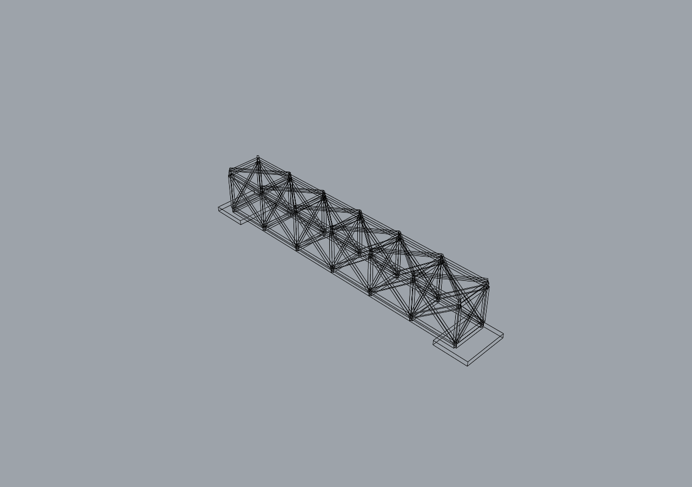
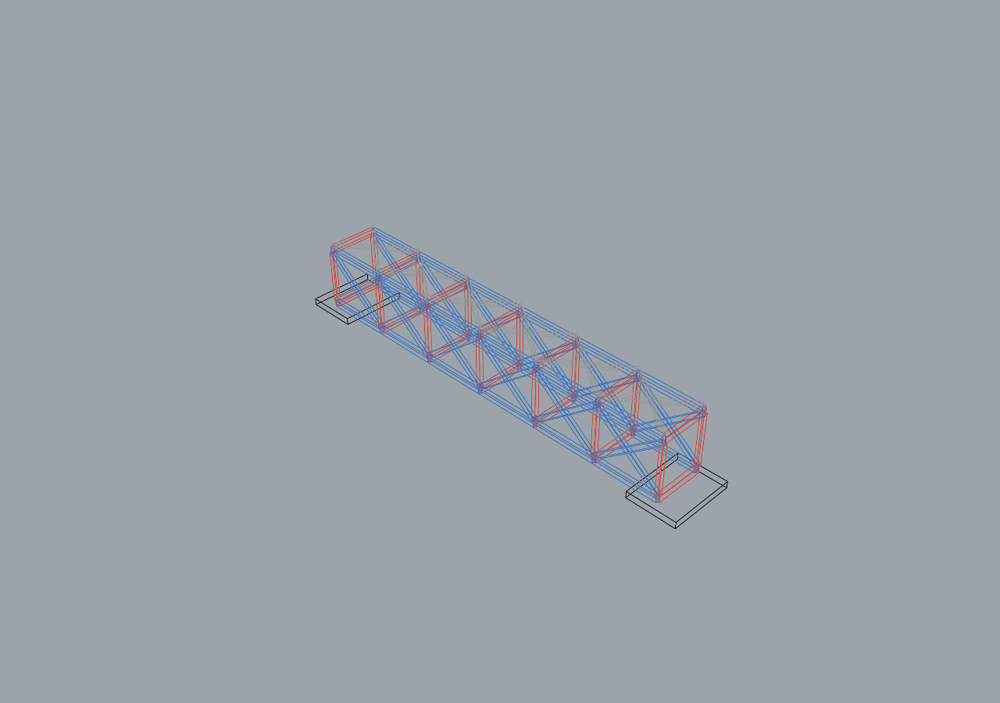
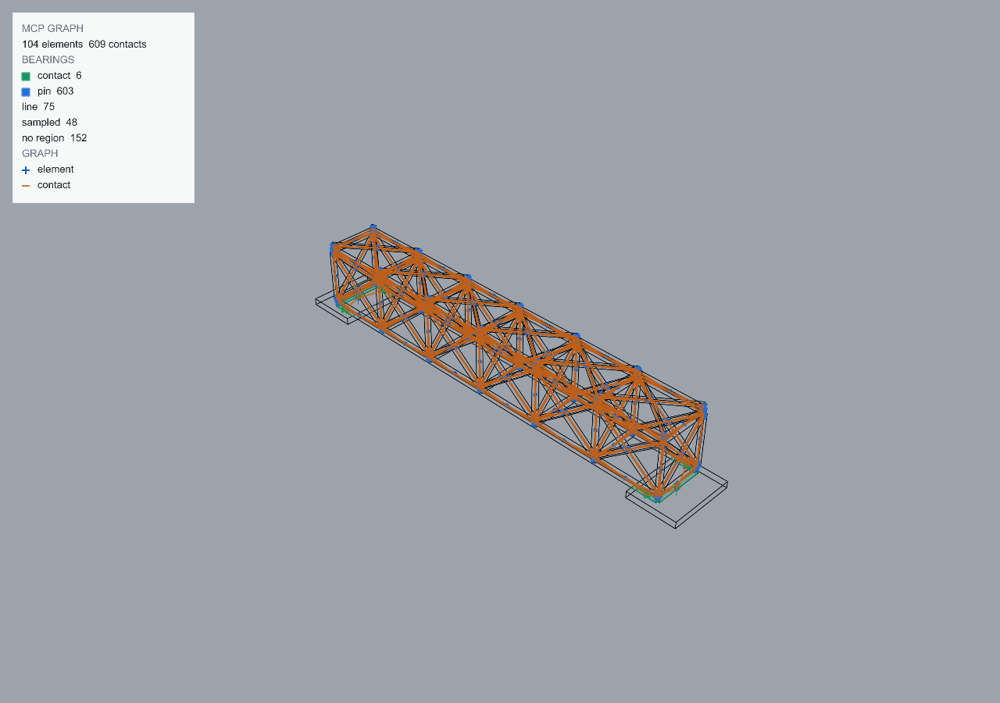
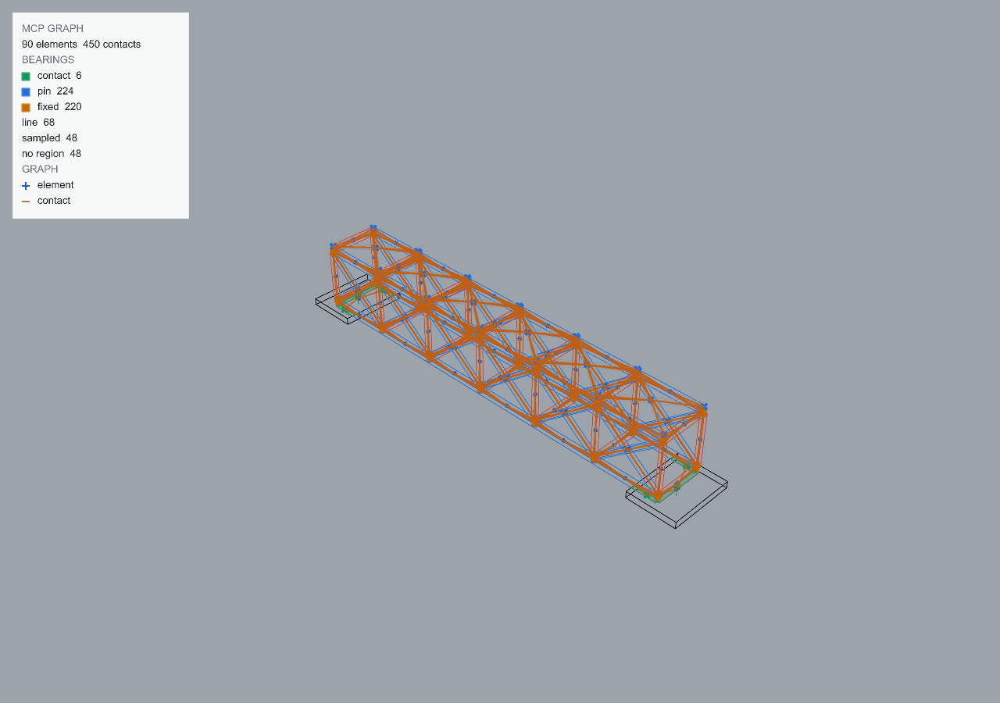

# Worked example: the two timber bridges

<!-- run: 2026-08-29, plugin 0.3.1 -->

Two 24 m timber trusses on two pads, drawn to the same span. One is x-braced in plan and
elevation; the other has no diagonals and rigid portal frames instead. Both stand. The
pipeline below runs on each, and the sway probe at the end is what tells them apart.

| | `timber_bridge_xbraced.3dm` | `timber_bridge.3dm` |
| --- | --- | --- |
| elements | 104 on `TRUSS` + 2 on `PAD` | 48 `BEAM`, 28 `PORTAL`, 12 `PLANK`, 2 `PAD` |
| mass | 37.2 t | 35.8 t |
| rules stored | `PAD\|TRUSS` contact, `TRUSS\|TRUSS` pin | 9: pins between beams and planks, fixed wherever a portal meets anything, contact on the pads |




**1. Open and look.**

```python
open_file("RhinoAndGHFiles/timber_bridge_xbraced.3dm", close_current=True)
get_document_info(detail="inventory", limit=10)
```

```text
{"meta_data": {"name": "timber_bridge_xbraced.3dm", "units": "Millimeters", "tolerance": 0.001},
 "object_count": 104, "objects_truncated": true,
 "objects": [{"id": "00892d31-...", "name": "DGB_1_01", "type": "Brep", "layer": "TRUSS"}, ...],
 "layers": [{"name": "TRUSS"}, {"name": "PAD"}]}
```

Names carry the member family: `TOP`, `BOT` chords, `POST`, `RAFT`, `FLOOR`, `PLNA`/`PLNB`
purlins, `DGA`/`DGB` diagonals, `XFA`/`XFB` the cross bracing.

**2. Mass.** Already on every element in both files. To check without changing anything:

```python
assign_mass(density=2400, overwrite=False)    # assigns nothing; reports what is there
```

`total_mass_kg` 37231 and 35794; `skipped` empty. To set it from scratch, `assign_mass(density=…)`
with the timber's density.

**3. Rules.** Stored in the document; list them:

```python
assign_joint_type()
```

```text
x-braced: {"rules": [{"a": "layer:PAD",   "b": "layer:TRUSS", "joint_type": "contact"},
                     {"a": "layer:TRUSS", "b": "layer:TRUSS", "joint_type": "pin"}], "stale_rules": 0}
portal:   {"rules": [{"a": "ground:",      "b": "layer:PAD",    "joint_type": "contact"},
                     {"a": "layer:BEAM",   "b": "layer:BEAM",   "joint_type": "pin"},
                     {"a": "layer:BEAM",   "b": "layer:PAD",    "joint_type": "contact"},
                     {"a": "layer:BEAM",   "b": "layer:PLANK",  "joint_type": "pin"},
                     {"a": "layer:BEAM",   "b": "layer:PORTAL", "joint_type": "fixed"},
                     {"a": "layer:PAD",    "b": "layer:PORTAL", "joint_type": "contact"},
                     {"a": "layer:PLANK",  "b": "layer:PLANK",  "joint_type": "pin"},
                     {"a": "layer:PLANK",  "b": "layer:PORTAL", "joint_type": "pin"},
                     {"a": "layer:PORTAL", "b": "layer:PORTAL", "joint_type": "fixed"}], "stale_rules": 0}
```

The braced truss is bolted at its nodes and set on its pads. The portal bridge says where its
moment connections are: every joint a portal takes part in.

**4. Graph.**

```python
graph_display(enabled=True)
get_connectivity_graph()
```




The readout counts contacts between element pairs; the evaluation clusters those into joints
- 77 on the braced bridge, 206 on the portal one - because several members meet at one node.
Nothing dim in either picture: every contact was named by a rule. Two things to look for
before evaluating: a node with no edges (an element floating), and a bearing patch drawn on
the side of a pad under a member that sits on top of it
([08 - limitations](08-stability.md#limitations)).

**5. Evaluate.**

```python
evaluate_stability(mode="pinned")
```

| | x-braced | portal |
| --- | --- | --- |
| `stable` / `verdict` | true / `stable` | true / `stable` |
| `joint_count` and types | 77: 24 contact, 53 pin | 206: 24 contact, 70 pin, 112 fixed |
| `max_pin_displacement_m` | 0.00305 | 0.00073 |
| `mechanism_threshold_m` | 0.136 (span 27.3 m) | 0.136 |
| `settled_displacement_m` | 0.00123 | 0.00044 |
| `contact_joints_sided` / `_open` | 48 / 16 | 48 / 0 |
| `joint_forces_summary.max_tension_n` | 14109 (a pin) | 8387 (a fixed joint) |
| `ground_sites_summary.fz_total_n` | 340583 | 351052 |

Both stand, an order of magnitude inside the mechanism threshold. The braced bridge moves
four times as much at its worst pin and opens 16 of its 48 bearings - the diagonals pull on
their chords and a bearing that is pulled lifts; the portal bridge, carrying its sway in
bending, lifts none. Its most-loaded joint is a fixed one, at 60% of the braced bridge's
most-loaded pin.

**6. Read the report.** The most-tensioned joints and what they join:

```python
get_stability_report(section="joint_forces", limit=5)
get_stability_report(section="joint_forces", joint_type="contact", sort="shear_n", limit=5)
get_stability_report(section="nodes", limit=5)
```

```text
x-braced, joint_forces by tension: [{"body": 43, "guid": "0700897d-...", "joint_type": "pin", "with": [46, 47, 49, 59, 70, 99],
                                     "force_n": 14125.5, "tension_n": 14108.7, "shear_n": 689.5, "bearing_points": 1}, ...]
```

`body` 43 is `BOT_1_03`, a bottom chord, pulled at its node by six members. On the portal
bridge the same query returns fixed joints at the portal legs, each with `bearing_points`
above 1 - a fixed joint keeps its bearing's spread, a pin has one point.

**7. Sway.** The probe: settle, push sideways with 5% of the carried weight along x and along
y, report the stiffness. The braced bridge is still moving at the default half second, so it
is given longer.

```python
evaluate_stability(mode="pinned", lateral_load_fraction=0.05, duration_seconds=1.5)
```

| `sway` | x-braced | portal |
| --- | --- | --- |
| `sway_stiffness_x_n_per_m` (along the span) | 4.67e7 | 2.95e8 |
| `sway_stiffness_y_n_per_m` (across) | 3.67e7 | 3.28e7 |
| `softest_direction` | y | y |
| `notional_load_n` | 18256 | 17551 |
| `settled` at the end of the run | false | true |

Across the span the two are alike: 3.7e7 against 3.3e7 N/m, the pads and the deck doing the
same work in both. Along it the portal bridge is six times stiffer - its 112 fixed joints
carry longitudinal sway in bending, while the braced truss's pins let it rack until the
diagonals take up. The braced bridge's figures carry a caveat: `settled` is false, so its
stiffness was measured on a structure still creeping, and a longer `duration_seconds` would
move them. Rerun with `detail="full"` or page `sway` from the report to see the drift ratios.

**8. See it.**

```python
evaluate_stability(mode="pinned", display=True)
```

draws each element where it came to rest, grey over the original. At these displacements
the two coincide on screen; the settled pose earns its place on the stair
([08](08-stability.md)). `mcpmodstabilitydisplay Off` hides it.

**9. Clear.** `-mcpmodclearcache` removes the stored graph, the settled poses and the masses
from this document; the joint rules stay unless `assign_joint_type(clear=True)`.
